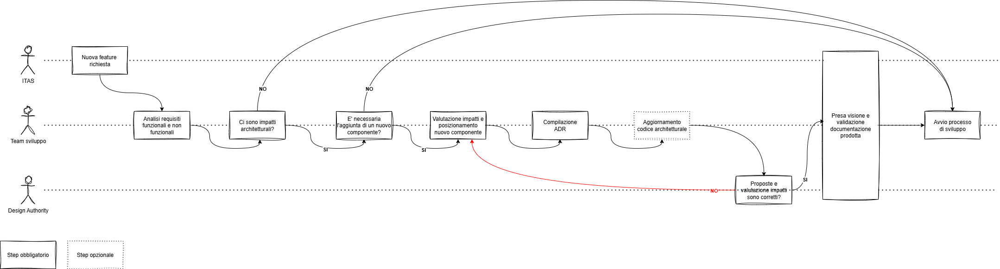

<!-- TOC -->
  * [Informazioni generali](#informazioni-generali)
    * [Terminologia](#terminologia)
  * [Introduzione nuovo componente](#introduzione-nuovo-componente)
    * [Valutazione impatti](#valutazione-impatti)
      * [Impatto business](#impatto-business)
      * [Impatto processing](#impatto-processing)
      * [Impatto memoria](#impatto-memoria)
      * [Impatto dati](#impatto-dati)
      * [Impatto storage](#impatto-storage)
    * [Valutazione requisiti di posizionamento in base all'impatto](#valutazione-requisiti-di-posizionamento-in-base-allimpatto)
      * [Impatto business](#impatto-business-1)
      * [Impatto dati](#impatto-dati-1)
      * [Impatto storage](#impatto-storage-1)
    * [Impatti Processing e Memoria](#impatti-processing-e-memoria)
  * [Step creazione e requisiti nuovo componente](#step-creazione-e-requisiti-nuovo-componente)
    * [Requisiti Endpoint/API [TODO valutare altri aspetti dopo sessione di feedback]](#requisiti-endpointapi-todo-valutare-altri-aspetti-dopo-sessione-di-feedback)
<!-- TOC -->

## Informazioni generali

### Terminologia
In questo specifico documento, quando si parla di **componente** si intende un qualsiasi componente architetturale in grado di svolgere
operazioni su un server, e che dunque non siano eseguite direttamente sui client che ne richiedono l'esecuzione. 
Rientrano dunque nella seguente categoria, a titolo d'esempio i seguenti componenti:
- endpoint/API
- back-end classico (monolite)
- microservizio
- serverless function

Quando si parla di **nodo** si intende un qualsiasi elemento infrastrutturale/architetturale in grado di ospitare un **componente**, alcuni esempi sono:
- virtual machine
- Kubernetes namespace 
- nodo di un cluster Kubernetes

Tuttavia, quando si parla di componenti che rappresentano di fatto degli endpoint, il concetto di nodo puo espandersi
anche al back-end/microservizio che li integra.

## Introduzione nuovo componente
Rientrano nella definizione di "nuovo componente back-end" i seguenti elementi:
- endpoint/API
- microservizio
- back-end (monolite)
- batch

### Valutazione impatti
Prima di capire dove posizionare uno specifico componente è necessario effettuare delle valutazioni sugli impatti dello stesso.
Di seguito sono dunque riportate le varie macro-categorie di impatto.

#### Impatto business
Descrive il tipo di impatto che il componente ha sull'operatività degli utenti.

[//]: # (**TODO valutare altri impatti**)

| Parametri valutazione impatto | Descrizione                                                                      | Livello 1                                                                              | Livello 2                                                                                                                     | Livello 3                                                                                                            |
|-------------------------------|----------------------------------------------------------------------------------|----------------------------------------------------------------------------------------|-------------------------------------------------------------------------------------------------------------------------------|----------------------------------------------------------------------------------------------------------------------|
| % utilizzo feature            | % di utilizzo di una specifica feature all'interno del relativo flusso operativo | impatto basso (funzionalità usata < 10% rispetto al flusso principale di appartenenza) | impatto medio (funzionalità usata 10% - 30% rispetto al flusso principale di appartenenza)                                    | impatto alto (funzionalità usata \> 30% rispetto al flusso principale di appartenenza)                               |
| Criticità feature             | Livello di impatto della funzionalità sull'operatività degli utenti              | impatto basso, eventuali malfunzionamenti non hanno impatto sull'operatività utente    | impatto medio, eventuali malfunzionamenti hanno un piccolo impatto sull'operatività utente senza però bloccarla completamente | impatto alto, una o più funzionalità del sistema sono completamente bloccate a causa di errori su questo componente  |

**Esempi:** 
- la scontistica viene utilizzata solo nel 20% dei preventivi/polizze creati, dunque ha un impatto medio (L2). 
- il calcolo del premio viene utilizzato nel 99% dei preventivi/polizze creati, dunque ha un impatto alto (L3).  

#### Impatto processing
Impatto del componente a livello di consumo di risorse CPU.

**TODO valutare se questi razionali richiedono migliorie**
Sono stati usati questi razionali per definire i limiti di throughput
- Dati presi da 31/07/2025 dalle 8.00 alle 20.00
- Tot chiamate: 22.558.544
- Tot endpoint chiamati: 1.217
- numero medio chiamate in fascia oraria: 18.536
- numero medio chiamate al sec: 0.42 req/s

| Parametri valutazione impatto                      | Descrizione                                                                                                 | Livello 1                                                                   | Livello 2                                           | Livello 3                                         |
|----------------------------------------------------|-------------------------------------------------------------------------------------------------------------|-----------------------------------------------------------------------------|-----------------------------------------------------|---------------------------------------------------|
| Throughput potenziale                              | Numero massimo di richieste al secondo che il componente potrebbe dover gestire                             | <= 0.5 req/s                                                                | 0.5 - 5  req/s                                      | \> 5 req/s                                        |
| Parallelismo                                       | Parallelismo generato dal componente (es. chiamate parallele per invocare servizi esterni)                  | Nessuno                                                                     | 2x                                                  | \> 2x                                             |
| % codice dedicato a data analytics                 | Percentuale di codice del componente che si occupa di effettuare analisi dei dati                           | 0%                                                                          | fino al 30%                                         | \> 30%                                            |
| Elaborazioni media                                 | Tipologia di elaborazioni effettuate su file/immagini/audio/video                                           | Nessuna                                                                     | Elaborazione immagini/file < 2MB                    | Elaborazione file/immagini >= 2MB o video         |
| Utilizzo di algoritmi di crittografia/compressione | Percentuale di esecuzioni del componente in cui è richiesto l'uso di algoritmi di crittografia/compressione | <= 10%                                                                      | 10% -50%                                            | \>= 50%                                           |
| Serializzazioni/deserializzazioni                  | Numero di serializzazione/deserializzazione di strutture dati complesse (ex. JSON, XML, etc...)             | Nessuna elaborazione o elaborazione di strutture dati non superiori ai 50KB | Elaborazione di strutture dati tra i 50KB e i 512KB | Elaborazione di strutture dati superiori ai 512KB |

#### Impatto memoria
Impatto del componente a livello di consumo di RAM.

Viene calcolato in base a quelle che sono i potenziali accessi da parte del componente a servizi che richiedono wait
e alle operazioni che richiedono processing/cache in memoria. 
Non verranno dunque utilizzati parametri come "consumo di RAM atteso" in quanto non facilmente calcolabili in fase di 
design del componente.

| Parametri valutazione impatto             | Descrizione                                                                   | Livello 1                      | Livello 2                            | Livello 3                          |
|-------------------------------------------|-------------------------------------------------------------------------------|--------------------------------|--------------------------------------|------------------------------------|
| In memory processing                      | Peso in memoria di file elaborati                                             | <= 512KB                       | 512KB -1MB                           | \> 1MB                             |
| Gestione strutture dati                   | Presenza di array, liste o oggetti di grandi dimensioni elaborati             | Strutture fino a 1000 elementi | Strutture tra 1000 e 10.000 elementi | Strutture oltre i 10.000 elementi  |
| Uso di cache in RAM                       | Numero max. di oggetti salvati in cache dal componente                        | <= 10                          | 10 -20                               | \> 20                              |
| Integrazioni sincrone con servizi esterni | Numero di potenziali integrazioni con servizi esterni (db, altre API, etc...) | <= 3                           | 3 -10                                | \> 10                              |

#### Impatto dati
Impatto del componente a livello di utilizzo del DB.

| Parametri valutazione impatto     | Descrizione                                                           | Livello 1                         | Livello 2                                         | Livello 3                                                 |
|-----------------------------------|-----------------------------------------------------------------------|-----------------------------------|---------------------------------------------------|-----------------------------------------------------------|
| Numero di query al DB per request | Quante interrogazioni vengono effettuate nelle logiche del componente | <= 3 query                        | 3–6 query                                         | \> 6 query                                                |
| Peso medio query                  | Complessità media delle interrogazioni                                | Query su indice o dataset ridotto | Query con join multiple o dataset medi (10k–100k) | Query con full scan o dataset molto grandi (> 100k righe) |

[//]: # (| Payload medio in ingresso/uscita  | Dimensione dei dati inviati/ricevuti                                 | <= 100KB                          | 100KB -1MB                                        | > 1MB                                                     |)

#### Impatto storage
Impatto del componente a livello di utilizzo dello storage.

| Parametri valutazione impatto                    | Descrizione                                                       | Livello 1                                        | Livello 2                        | Livello 3                                    |
|--------------------------------------------------|-------------------------------------------------------------------|--------------------------------------------------|----------------------------------|----------------------------------------------|
| Elaborazioni media                               | Tipologia di elaborazioni effettuate su file/immagini/audio/video | Nessuna                                          | Elaborazione immagini/file < 2MB | Elaborazione file/immagini >= 2MB o video    |
| Volume di log generati (solo se scritti su file) | Quantità media di righe di log prodotte per richiesta             | < 20                                             | 20 - 50                          | \> 50                                        |
| Archiviazione di file                            | Presenza di salvataggi su filesystem                              | Nessuna                                          | File fino a 10MB                 | File \> 10MB o frequenti                     |
| Retention policy                                 | Tempo di conservazione dati/log                                   | <= 1 giorno                                      | 1 - 30 giorni                    | > 30 giorni                                  |

---

### Valutazione requisiti di posizionamento in base all'impatto
Una volta effettuata una valutazione di quelli che sono i vari impatti che il componente ha, utilizzando la media per ciascuna
categoria di impatto, si può passare a decidere dove posizionare tale componente secondo vari criteri associati ai livelli di impatto
calcolati.

Indipendentemente dal livello di impatto, però, valutare sempre tramite l'apposita matrice [TODO LINK a excel per calcolo impatto - parte relativa a cpu/ram]() se il "nodo" 
sul quale posizionare il componente abbia disposizione risorse a sufficienza per sopportare il carico introdotto da tale componente.

Nel caso in cui il componente sia un endpoint, quando il parametro di valutazione di impatto consiglia l'inserimento all'interno
di un nodo ad hoc si può valutare il posizionamento all'interno di un microservizio o back-end ad hoc.

**Esempio:** si ha necessità di creare un nuovo endpoint, il relativo impatto è L3 e dunque è consigliato inserirlo in un
nodo ad hoc. Nel caso di un architettura a microservizi o service-based, si può optare per creare un nuovo microservizio
all'interno del quale posizionare questo endpoint, avendo cura di deployare il microservizio in un nodo che abbia capacità 
sufficienti (nel caso di VM già contenenti altri componenti, si può valutare l'uso di una porta libera associata ad
opportune regole di routing).

#### Impatto business
Come posizionare il componente in base alla media dei parametri di impatto business:
- **Livello 1** - Valutare di inserirlo su sistemi che non siano saturi a livello di risorse.
- **Livello 2** - Ridondanza necessaria, valutare di inserirlo all'interno di un nodo con altri componenti dello stesso livello ma legati strettamente allo stesso dominio
- **Livello 3** - Ridondanza necessaria, su nodi ad hoc o contenenti componenti con stesso livello di criticità ma legati strettamente allo stesso dominio

**Esempio business L1:**
Nuovo endpoint che recupera il numero di polizze emesse dall'agente che sta utilizzando il software, tale numero verrà mostrato
nella home page.

**Esempio business L2:**
Nuovo endpoint che si occupa di gestire le convenzioni, il cui utilizzo è stimato intorno al 20% rispetto al numero di preventivi/polizze generati.
In questo caso, supponendo che vi sia già un microservizio che si occupa di gestire la scontistica per i preventivi/polizze,
vi si potrebbe inserire anche questo endpoint, in quanto anche gli altri endpoint che gestiscono la scontistica sono utilizzati
tra il 10% e il 30% rispetto al numero di preventivi/polizze generati.

**Esempio business L3:**
Nuovo endpoint che recupera informazioni aggiuntive **obbligatorie** sulle garanzie per tutti i prodotti, senza le quali l'agente 
non può configurare correttamente il preventivo → si inserisce nello stesso BE che recupera la lista delle garanzie qualora
il sistema su cui è attualmente presente lo permetta in termini di risorse.

In questo caso, supponendo che il BE nel quale si vuol inserire il nuovo endpoint contiene
gli endpoint che lavorano esclusivamente con le garanzie, ha senso inserire un ulteriore endpoint che lavora sempre
sugli stessi dati poiché in caso di anomalie, vista la natura obbligatoria di tali dati ai fini della preventivazione, 
è ammissibile che possa causare il malfunzionamento dei restanti endpoint. In parole povere è ammissibile che guasti provocati
da un endpoint che lavora sulle garanzie provochi guasti all'intero sistema che si lavora sulle garanzie di cui fa parte. 
Diverso sarebbe stato il ragionamento se si fosse introdotto in tale sistema un endpoint che lavora sull'anagrafica, in quanto
un malfunzionamento di un endpoint che gestisce le garanzie avrebbe provocato anche problemi sulla gestione dell'anagrafica, 
di fatto comportando il break di due funzionalità distinte.

#### Impatto dati
Come posizionare il componente in base alla media dei parametri:
- **Livello 1** - Valutare di inserirlo su nodi che non siano saturi a livello di risorse.
- **Livello 2** - Valutare di inserirlo su nodi non condivisi con componenti critici dal punto di vista business, qualora l'ambito sia prettamente analitico utilizzare quanto più possibile a logiche asincrone o di schedulazione temporizzata.
- **Livello 3** - Valutare di inserirlo su nodi ad hoc affiancati da sistemi di streaming di dati (Kafka o simili).

#### Impatto storage
Come posizionare il componente in base alla media dei parametri:
- **Livello 1** - Valutare di inserirlo su nodi che non siano saturi a livello di risorse, affiancati da sistemi di storage con prestazioni equiparabili ad HDD.
- **Livello 2** - Valutare di inserirlo su nodi che non siano saturi a livello di risorse, affiancati da sistemi di storage con prestazioni equiparabili ad SSD e regole di archiviazione progressiva per risparmio costi.
- **Livello 3** - Valutare di inserirlo su nodi ad hoc, affiancati da sistemi di storage con prestazioni specifiche per operazioni IOPS-intensive e regole di archiviazione progressiva per risparmio costi.

### Impatti Processing e Memoria
Di seguito è riportata una tabella in cui vengono stimati CPU e RAM in base agli impatti su memoria e processing
di un componente avente le seguenti caratteristiche:
- Viene interrogato/eseguito 100 volte al secondo
- Lavora su un singolo worker/thread

È stata quindi utilizzata la seguente baseline di CPU e RAM: 
- Processing L1 → CPU = 0.001 × RPS
- Processing L2 → CPU = 0.002 × RPS
- Processing L3 → CPU = 0.005 × RPS
- Memoria L1 → 50 MB per worker
- Memoria L1 → 150 MB per worker
- Memoria L1 → 500 MB per worker
- Peak Factor (fattore di crescita in caso di picchi) = 30%

| **Area di impatto** | **Processing L1**       | **Processing L2**       | **Processing L3**       |
|---------------------|-------------------------|-------------------------|-------------------------|
| **Memoria L1**      | 0.13 vCPU - 65 MB RAM   | 0.26 vCPU - 65 MB RAM   | 0.65 vCPU - 130 MB RAM  |
| **Memoria L2**      | 0.13 vCPU - 195 MB RAM  | 0.26 vCPU - 195 MB RAM  | 0.65 vCPU - 195 MB RAM  |
| **Memoria L3**      | 0.13 vCPU - 650 MB RAM  | 0.26 vCPU - 650 MB RAM  | 0.65 vCPU - 650 MB RAM  |

**NOTA:** questi calcoli non risultano universalmente validi in quanto hanno una forte dipendenza dalla runtime (Java, NodeJS, etc...)
con la quale viene eseguito il codice e dal relativo contesto tecnologico (VM, POD Kubernetes, etc...).

---

## Step creazione e requisiti nuovo componente
Quando si introduce un nuovo componente bisogna rispettare alcuni requisiti sia in fase di progettazione che di realizzazione dello stesso,
nonché alcuni step obbligatori necessari a una corretta documentazione dello stesso.

Gli step obbligatori da rispettare sono i seguenti:

1. Compilazione del file Excel con gli impatti del nuovo componente ([TODO aggiungere link a file excel di calcolo](my\trucchi_del_mestiere\architecture\adr\be_component_impact_analysis.xlsx`)
2. Valutazione del posizionamento del nuovo componente
3. Compilazione ADR ([adr_nuovo_componente_BE](../adr/adr_new_backend_component.md)
4. [Opzionale] Aggiornamento del codice architetturale nel rispettivo repository (valutare quando necessario in base a [TODO aggiungere link a guida](../design-authority.md))
5. Attesa revisione e validazione da parte della Design Authority dei deliverable prodotti agli step 3-4 
6. Presa visione e validazione della documentazione prodotta da parte di tutti gli attori coinvolti
7. Avvio processo di sviluppo del componente

Qualora gli step di validazione non dovessero andare a buon fine, sarà necessario reiterare gli step
opportuni fino a validazione ottenuta.

[//]: # (### TODO valutare di inserire una checklist utile per verificare gli standard del componente?)

### Requisiti Endpoint/API [TODO valutare altri aspetti dopo sessione di feedback]
Di seguito sono riportati una serie di requisiti generici per gli endpoint/API sviluppati:
- devono utilizzare tecnologie che permettano di generare automaticamente le specifiche **OpenAPI** adatte alla documentazione delle API 

[//]: # (### Requisiti batch TODO spingersi fino a questo dettaglio?)

[//]: # (Di seguito sono riportati una serie di requisiti generici per i batch sviluppati:)

[//]: # (- Compilazione della tabella di scheduling TODO qui va capito per bene se tutti i batch vengono gestiti da opcon)
