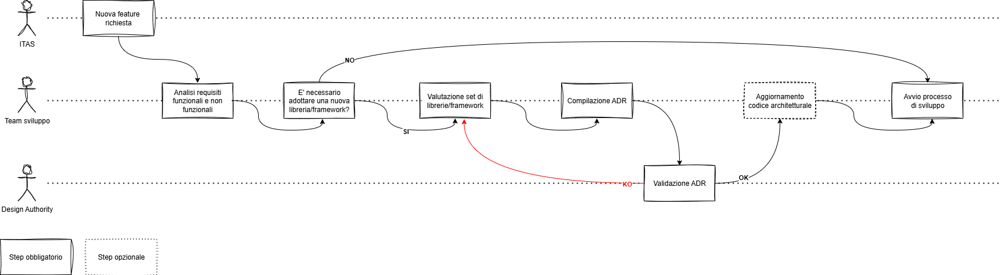
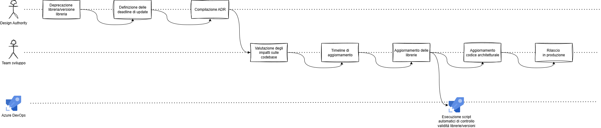

<!-- TOC -->
* [Adozione di librerie/framework/sistemi di integrazione](#adozione-di-librerieframeworksistemi-di-integrazione)
  * [Adozione librerie/framework](#adozione-librerieframework)
    * [Creazione di un nuovo componente/progetto](#creazione-di-un-nuovo-componenteprogetto)
  * [Deprecazione di librerie/framework](#deprecazione-di-librerieframework)
* [TODO sezioni successive bozza/da eliminare](#todo-sezioni-successive-bozzada-eliminare)
* [Gestione obsoloscenza](#gestione-obsoloscenza)
* [Integrazione AI/Tool di code quality](#integrazione-aitool-di-code-quality)
<!-- TOC -->

# Adozione di librerie/framework/sistemi di integrazione

## Adozione librerie/framework
L’adozione di un nuovo framework o di una libreria richiede una valutazione attenta e strutturata. 
Le scelte tecnologiche effettuate in questa fase possono infatti avere un impatto significativo non solo sullo sviluppo e la manutenibilità del software, ma anche sulla sicurezza, 
sulle performance dell’infrastruttura IT.

Per questo motivo è stata definito un processo di proposta e validazione della scelta di un framework/libreria (anche open source).
Gli obiettivi principali di tale processo sono:

- Standardizzare il processo di valutazione delle librerie, evitando decisioni arbitrarie o basate solo su preferenze personali
- Ridurre i rischi legati a vulnerabilità, obsolescenza o lock-in tecnologico
- Garantire l’allineamento con le policy aziendali in tema di licenze, sicurezza, integrazione e compliance
- Tenere traccia delle motivazioni che hanno portato alla scelta finale
- Supportare la sostenibilità a lungo termine degli applicativi, assicurando che ogni dipendenza sia sicura, manutenibile e ben supportata

Supponendo che sia necessario inserire una nuova libreria/framework, gli step da seguire sono i seguenti:

1. Effettuare una valutazione delle potenziali alternative (qualora vi fossero)
2. Compilare il relativo ADR [adr_adozione_framework_libreria.md](../adr/adr_framework_library_adoption.md) e tutte le informazioni che esso richiede
3. Richiedere la validazione dell'ADR da parte della Design Authority
4. Qualora dovesse essere validato procedere con lo step successivo, altrimenti rivedere l'ADR
5. [Opzionale] Qualora si stia adottando un framework/libreria che costituisce una parte fondamentale del componente per cui si utilizza, procedere con l'aggiornamento del codice architetturale
inserendo le opportune informazioni secondo le linee guida di compilazione dello stesso
6. Procedere con l'integrazione della libreria e gli sviluppi

### Creazione di un nuovo componente/progetto
All'inizio di un nuovo progetto, o comunque alla creazione di un nuovo componente, il numero di librerie/framework coinvolti potrebbe
essere alto, dunque tale flusso potrebbe risultare eccessivamente "burocratico".

Per questo dunque risultano disponibili una serie di tabelle, suddivise per linguaggio di programmazione, in cui sono elencate
le librerie/framework ammessi e quali sono i relativi range di versioni che è possibile utilizzare.

Qualora dovessero essere necessarie delle deroghe straordinarie per l'adozione di librerie/framework diversi da quelli indicati
sarà necessario creare e richiedere validazione degli opportuni ADR.

[//]: # (**TODO creare le tabelle in base all'attuale situazione di ITAS e inserire link:**)

[//]: # (- librerie java)

[//]: # (- librerie nodejs)

[//]: # (- librerie altri linguaggi)

## Deprecazione di librerie/framework
I motivi per cui una libreria/framework potrebbe essere deprecata, o addirittura vietata, sono i seguenti:
- end of support (obsolescenza)
- trovata una vulnerabilità di sicurezza 
- scarsa affidabilità
- valutata alternativa più adatta

La deprecazione di librerie/framework e/o versioni specifiche degli stessi potrà avvenire tramite un mix di diversi approcci:
- **manuale:** vengono individuate delle criticità o limitazioni non valutabili automaticamente per cui sia necessario deprecare una versione/libreria/framework;
- **automatica:** verranno utilizzati dei tool appositi in pipeline DevOps per la valutazione di eventuali deprecazioni e/o vulnerabilità che 
potrebbero quindi portare a un aggiornamento/rimozione di una specifica libreria/framework.

Il processo di deprecazione delle librerie sarà il seguente:

1. La Design Authority individua e marca come deprecata la libreria in questione
2. La Design Authority definisce la deadline entro la quale aggiornare (o sostituire) tale libreria
3. La Design Authority compila l'ADR [adr_deprecazione_libreria.md](../adr/adr_library_deprecation.md) con i dettagli relativi alla deprecazione
4. Il team di sviluppo effettua la valutazione degli impatti sulle codebase coinvolte da tale deprecazione
5. Il team di sviluppo definisce una timeline di aggiornamento per le varie codebase
6. Il team di sviluppo procede con l'aggiornamento
7. Il team di sviluppo aggiorna il codice architetturale nel caso in cui si tratti di una libreria/framework major mappata al suo interno
8. In parallelo, a fronte delle build delle codebase modificate, una pipeline si occuperà di valutare nuovamente la correttezza delle dipendenze
9. Qualora tutti i controlli di qualità vadano a buon fine, gli applicativi vengono rilasciati in produzione secondo la schedulazione concordata

---

**TODO puo' aver senso avere un calcolo matematico degli impatti di una libreria/framework su una codebase per non lasciarla alla sensitivita' dei fornitori? 
(attenzione che pero' potrebbe non essere fattibile misurare l'impatto di una libreria in una code base, vedi l'isolamento della stessa in una classe/package ad hoc)**

Nel momento in cui una libreria viene deprecata seguirà un periodo limite entro il quale essa andrà aggiornata. 
Tale periodo verrà definito facendo una valutazione dei seguenti parametri sulla codebase in esame:

| Parametro            | Descrizione                                                                                                   | Valori ammessi |
|----------------------|---------------------------------------------------------------------------------------------------------------|----------------|
| Impatto libreria     | In una scala da 1 a 10, quanto tale librerie/framework impatta sulle funzionalità dell'applicativo in oggetto | 1-10           |
| Dimensione codebase  | Numero di **code statements** della codebase in esame                                                         | Numero intero  |
| Numero dipendenze    | Numero di **code statements** della codebase in esame                                                         | Numero intero  |
| Criticità componente | Indica la criticità di un componente dal punto di vista del business                                          | 1-10           |

TODO indicare un processo in cui si bandiscono/deprecano delle librerie e 
delle metriche secondo le quali stabilire delle tempistiche limite entro le quali
fare l'aggiornamento

**TODO prevedere uno script che prenda calcoli in automatico tali parametri e li inserisca su un DB ad hoc
questo potrebbe essere utile per avere un'informazione veloce e centralizzata dei tempi stimati per l'update**

**TODO uno spunto interessante sarebbe automatizzare questo processo tramite script devops che gira ogni notte effettuando 
una scansione delle dipendenze degli applicativi e controllando che
non siano deprecate per qualsiasi motivo**

**TODO nel caso in cui si vogliano inerire queste informazioni su librerie e versioni supportate su un DB questo DB dovra'
essere duplicato su piu cloud nel caso in cui ci siano piu cloud utilizzati, potrebbe essere utile creare una pipeline
e inserire queste info in del codice (es. json)**

---

# TODO sezioni successive bozza/da eliminare

---

# Gestione obsoloscenza
1. A inizio anno si fa un elenco delle tecnologie/framework utilizzati
2. Si valuta la relativa scadenza del supporto
   1. qualora la scadenza sia inferiore ad un anno, TODO
   2. qualora la scadenza sia superiore ad un anno, prevedere un piano di rientro
   3. qualora la scadenza sia inferiore ad un anno, TODO

Quando si seleziona uno specifico framework/tecnologia/runtime bisogna sempre creare
un ADR in cui specifica anche l'intervallo di tempo ogni quanto sarà effettuare un update
di version per evitare l'obsolescenza [adr_adozione_framework_libreria.md](../adr/adr_framework_library_adoption.md)

---

# Integrazione AI/Tool di code quality
- fare riferimenti alle automazioni per individuare obsolescenza (AI su info di structurizr)
