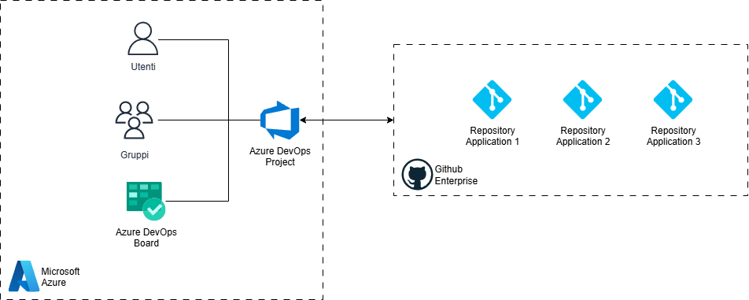
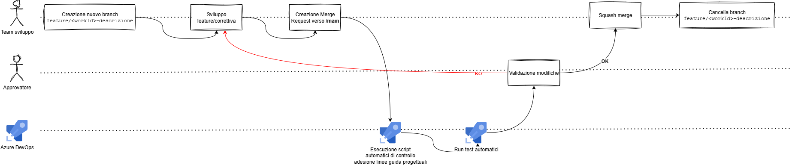
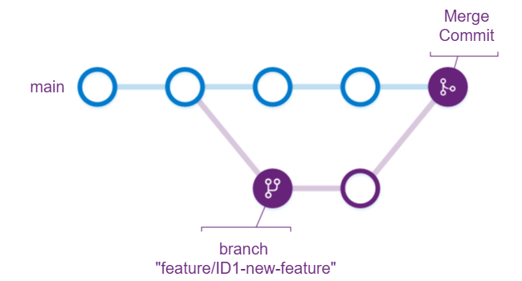

<!-- TOC -->
* [Git](#git)
  * [Struttura dei repository Git](#struttura-dei-repository-git)
    * [Naming convention](#naming-convention)
    * [Semantic versioning](#semantic-versioning)
    * [Tags](#tags)
    * [Branching Strategy](#branching-strategy)
      * [Nuova feature/bug fix](#nuova-featurebug-fix)
      * [Nuova release](#nuova-release)
      * [Hotfix](#hotfix)
    * [Merge Strategy](#merge-strategy)
      * [Revisione Merge/Pull request](#revisione-mergepull-request)
      * [Squash merge](#squash-merge)
    * [Monorepository vs Multi-repo](#monorepository-vs-multi-repo)
  * [Sicurezza](#sicurezza)
  * [Migrazione da TFS [TODO IN CORSO]](#migrazione-da-tfs-todo-in-corso)
    * [Step preliminari](#step-preliminari)
    * [Migrazione repository con git-tfs](#migrazione-repository-con-git-tfs)
<!-- TOC -->

# Git

## Struttura dei repository Git

Un progetto dovrà contenere tutti i repository relativi alle applicazioni in ambito, a titolo di esempio un applicativo
sui sinistri potrebbe avere i seguenti repository:

- repository front-end
- repository microservizio 1
- repository microservizio 2
- repository microservizio 3
- repository batch
- repository script SQL
- repository API Mulesoft

La definizione del progetto, e del relativo dominio, sarà dunque fondamentale per individuare i repository
che dovrà contenere.

Tali repository **dovranno essere creati su Github** e linkati al progetto Azure DevOps, in modo da poter
permettere il corretto tracking rispetto ai work item creati in **Azure DevOps Board**.



### Naming convention
Rispettare i seguenti requisiti per quanto riguarda la **naming convention** del repository:
* Utilizzo di soli caratteri alfanumerici
* Assenza di spazi, nel caso fosse necessario separare parole utilizzare il carattere `-`
* Formato `<dominio applicativo>-<suffisso>`
* Utilizzo dei seguenti suffissi obbligatori per migliorare l'identificazione degli applicativi:
  * `-fe` - applicativo front-end
  * `-mfe` - micro front-end
  * `-be` - applicativo back-end (monolite)
  * `-batch` - batch
  * `-microservice` - micro servizio
  * `-db` - file relativi a configurazione/popolamento database

Si dovrà inoltre garantire una corrispondenza 1:1 tra nome del repository e nome dichiarato all'interno di descrittori
di repository come `pom.xml`/`package.json`/ etc...

**Esempio:** supponendo di avere il repository "anagrafica-microservice" contenente un microservizio
sviluppato in NodeJS, il nome del microservizio stesso sarà dichiarato come di seguito nel relativo `package.json` :
```json
{
  "name": "anagrafica-microservice",
  "version": "1.0.0"
}
```

### Semantic versioning
Per garantire coerenza, chiarezza e prevedibilità nell’evoluzione del software, si raccomanda l’adozione del **Semantic Versioning**.
Questo sistema di versionamento si basa su un formato di versione composto da tre numeri:

`MAJOR.MINOR.PATCH`

- **MAJOR:** incrementato quando vengono introdotte modifiche incompatibili con le versioni precedenti (breaking changes).
- **MINOR:** incrementato quando vengono aggiunte nuove funzionalità che però risultano retrocompatibili.
- **PATCH:** incrementato quando vengono rilasciate correzioni di bug o miglioramenti minori che non alterano le funzionalità esistenti.

Benefici principali di questo approccio sono:

- Adozione di uno standard consolidato che permette di gestire un modo omogeneo un parco librerie/applicativi
- Gli sviluppatori e i team di integrazione possono comprendere immediatamente l’impatto di un aggiornamento.
- Si integra facilmente nei flussi CI/CD, consentendo una gestione efficiente di Git tag e versioni degli artifact prodotti.

### Tags
L'adozione del semantic versioning dovrà essere affiancata all'utilizzo dei tag tramite Git per poter
creare dei punti di rollback ben definiti nella code base.

**L'uso del tag è obbligatorio ogni qualvolta viene effettuato un rilascio dell'applicativo in ambiente
di produzione.**

### Branching Strategy

Adottare una strategia di branching aziendale Git Flow, riassunta nella seguente immagine:


Le "tipologie" di branch sono dunque le seguenti:
- `main` → produzione
- `develop` → integrazione
- `feature/<id>-descrizione` → branch utilizzato da uno o più sviluppatori per lo sviluppo di una feature o la risoluzione di un bug 
- `release/x.y.z` → branch utilizzato per la preparazione ad un nuovo rilascio, eventuali fix per la release in oggetto dovranno essere apportate qui
- `hotfix/x.y.z` → branch utilizzato per un hotfix in produzione, nel caso di bug particolarmente critici

Nel caso dei branch più critici, quali ad esempio `main` e `develop`, si dovranno impostare 
delle regole di merge e accesso stringenti, in particolare:
  - Divieto di force push e cancellazione;
  - Build valida prima di poter approvare una Merge/Pull request;
  - Qualora presenti, test automatici eseguiti con successo;
  - Divieto di push diretto di codice, se non tramite approvazione di Merge/Pull request avente le seguenti caratteristiche:
    - Minimo 1–2 approvatori
    - Work item collegato;
    - Risoluzione di tutti i commenti;

#### Nuova feature/bug fix
1. Staccare il branch `feature/<id>-descrizione` da `develop`
2. Effettuare le modifiche necessarie
3. Richiedere una Merge/Pull request verso `develop`
4. A merge effettuato, eliminare il branch

#### Nuova release
1. Staccare il branch `release/x.y.z` da `develop`
2. Qualora tale branch non fosse usato immediatamente per effettuare un rilascio, qualsiasi modifica dovesse
risultare necessaria per correggere bug relativi a tale release dovrà essere fatta su questo branch
e sul branch `develop`
3. A rilascio effettuato, creare il tag `x.y.z` sul branch `main`
4. Eliminare il branch 

#### Hotfix
1. Staccare il branch `hotfix/x.y.z` da `main`
2. Effettuare le modifiche necessarie
3. Richiedere una Merge/Pull request verso `develop`
4. Validare la modifica effettuata
5. Effettuare un cherry pick della merge commit su develop e utilizzarlo per creare una Merge/Pull Request verso `main` 
6. A merge effettuato, eliminare il branch


### Merge Strategy

#### Revisione Merge/Pull request
Per mantenere una qualità del codice ottimale e garantire il rispetto delle linee guida progettuali è
necessario creare un processo di validazione del codice sviluppato dai vari membri del team.
Bisognerà dunque individuare per ciascun repository Git creato, almeno 2 approvatori che si occupino di revisionare e validare,
le Merge/Pull request, eventualmente anche grazie all'ausilio di script di validazione e strumenti AI/automatici.

Il processo sarà dunque il seguente:



1. Lo sviluppatore crea il branch legato allo specifico work item `feature/<workId>-descrizione`
2. Lo sviluppatore effettua le modifiche necessarie
3. Richiede una Merge/Pull request verso il branch scelto come target
4. Viene avviata la pipeline per effettuare le validazioni automatizzabili
5. Viene avviata la pipeline per eseguire i test automatici sul repository interessato
6. I validatori revisionano e approvano (o rigettano) la Merge/pull request
7. Lo sviluppatore conferma il merge
8. Lo sviluppatore cancella il branch sul quale ha effettuato gli sviluppi/correttive

#### Squash merge
La strategia **Squash merge** è consigliata in progetti enterprise dove il numero di commit su un progetto
risulta piuttosto elevato a causa della grandezza del team che ci lavora. Questo tipo di strategia
va sostanzialmente a creare un unico commit a fronte di una merge request approvata.



È possibile riassumere le caratteristiche del squash merge come segue:
- **PRO**:
  - permette di identificare in maniera più semplice tutte le modifiche legate ad una specifica attività qualora vi sia
    un corretto mapping **git branch - work item**
  - abilita a effettuare cherry pick di interi work item in modo più semplice
  - allo stesso modo permette rollback di interi work item in maniera più atomica
  - riduce le dimensioni della history Git
- **CONTRO**
  - riduce il livello di dettaglio della history, di fatto facendo perdere informazioni sulle commit °intermedie°
    effettuate durante lo sviluppo di uno specifico work item
  - può risultare di fatti inutile se non vi è una gestione strutturata del branching
  - per essere efficace, necessita della cancellazione del branch di origine

Si consiglia inoltre di inserire lo Squash merge come strategia di default e non permettere agli sviluppatori
di modificare tale opzione in fase di merge.

### Monorepository vs Multi-repo

Nel momento in cui si dovrà creare un repository bisognera prendere in considerazione, in base al suo contenuto, se
valutare l'utilizzo dell'approccio Monorepository o Multi-repo.
A grandi linee, i due approcci vengono usati per le seguenti esigenze:
- **Monorepository** - Molti componenti interdipendenti; forte riuso di librerie; necessità di refactoring frequenti che coinvolgono più applicazioni/librerie; investimento in tooling (build, code search, client SCM)
- **Multi-repo** - Microservizi realmente indipendenti; team autonomi con cicli e governance separati; poche dipendenze condivise.

Di seguito si riporta una tabella che può essere utilizzata come driver per tale scelta:

| Tema                                | Monorepo – Pro                                                                                    | Monorepo – Contro                                                                           | Multi-repo – Pro                                                                                     | Multi-repo – Contro                                                                                             |
|-------------------------------------|---------------------------------------------------------------------------------------------------|---------------------------------------------------------------------------------------------|------------------------------------------------------------------------------------------------------|-----------------------------------------------------------------------------------------------------------------|
| **Coordinamento cambi**             | Cambi atomici e coordinati su più componenti/librerie; grande abilità di refactoring trasversali. | Rotture di *main* bloccano tutti; maggiore blast radius quando qualcosa va storto.          | Ogni repo evolve in modo indipendente, riducendo l’impatto incrociato.                               | Cambi cross-repo richiedono PR sincronizzate e coreografie complesse.                                           |
| **Visibilità e discovery**          | Codice in un unico posto, dunque ricerca, navigazione e comprensione globali sono migliori.       | Accesso esteso può richiedere tooling/policy avanzate per limitare chi può fare cosa.       | Confini chiari tra domini; più semplice isolare contesti e ownership.                                | Minore visibilità trasversale; rischio di duplicazioni e scarsa riusabilità.                                    |
| **Dipendenze e riuso**              | Versioni allineate di librerie condivise.                                                         | Rischio di accoppiamento eccessivo se mancano regole e boundary chiari.                     | Versionamento indipendente per servizio/libreria; minor accoppiamento forzato.                       | Gestione pacchetti/relase tra repo più onerosa (pubblica/aggiorna/sincronizza).                                 |
| **CI/CD**                           | Pipeline unificate; possibile test/build selettivo per ciò che è cambiato.                        | CI complessa e pesante senza strumenti per *affected builds*.                               | Pipeline snelle e mirate per repo; cicli più rapidi.                                                 | Test e release end-to-end più difficili; integrazione tra pipeline separare.                                    |
| **Scalabilità degli strumenti SCM** | Funziona bene con tooling ad hoc (es. build system/clients scalabili).                            | Git “puro” può soffrire su repo enormi (clone, log, blame, history); servono tool dedicati. | Repos piccoli → operazioni Git più veloci e semplici.                                                | Molte repo da amministrare; sincronizzazione di policy e hook ripetitiva.                                       |
| **Governance e ownership**          | *Single source of truth*; standardizzazione coerente di regole e policy.                          | Permessi granulari per directory/progetti più difficili da modellare.                       | Ownership e responsabilità nette per repo; policy per-repo immediatamente applicabili.               | Rischio di *drift* tra standard diversi; enforcement duplicato in tanti posti.                                  |
| **Onboarding e produttività**       | Onboarding semplice (un solo repo, tooling condiviso); facile trovare esempi e pattern.           | Dimensioni/cronologia grandi possono rallentare setup locale senza cache/partial clone.     | Setup leggero e mirato al progetto del team.                                                         | Difficile scoprire e riusare codice altrui; conoscenza frammentata.                                             |
| **Rilasci e versioni**              | Allineamento versioni coerente; tag e release cross-component gestibili con processi comuni.      | Semantica di tag/release meno significativa per componenti non correlati nello stesso repo. | Rilasci indipendenti per servizio/libreria; cadenzamento autonomo.                                   | Problemi di dipendenze dovuti ad incoerenze di versione di librerie referenziate tra repo (diamond dependency). |
| **Sicurezza e compliance**          | Policy centralizzate, scanning uniforme sul perimetro unico.                                      | Superficie d’accesso ampia se i permessi non sono ben segmentati.                           | Access control fine-grained per repo; ridotto raggio d’esposizione per singolo incidente.            | Policy e scanner da replicare ovunque; maggiore rischio di buchi per disallineamento.                           |

Potrebbero esserci dei casi in cui repository di diverso tipo coesistono, ad esempio:
- repository microservizio 1
- repository microservizio 2
- monorepository librerie microservizi

In questo caso potrebbe risultare particolarmente efficiente gestire tutte le librerie in comune tra i microservizi
in un unico monorepository, in modo che non vi siano casi di dipendenze disallineate tra le stesse.

---

## Sicurezza

È assolutamente vietato versionare le seguenti informazioni:
- utenze e password per accesso a qualsiasi tipo di servizio richieda autenticazione
- secrets di qualsiasi genere

[//]: # (- TODO lista da continuare)

---

## Migrazione da TFS [TODO IN CORSO]

`git-tfs` consigliato anche nelle seguenti guide ufficiali:
- Azure DevOps https://learn.microsoft.com/en-us/azure/devops/repos/tfvc/comparison-git-tfvc?view=azure-devops&utm_source=chatgpt.com
- Gitlab https://docs.gitlab.com/user/project/import/tfvc/?utm_source=chatgpt.com

### Step preliminari
1. Ciascun fornitore deve eliminare i branch non più necessari per favorire il processo di conversione
2. Individuare la corretta divisione dei repository secondo le linee guida fornite di seguito
3. TODO in corso...

### Migrazione repository con git-tfs
https://github.com/git-tfs/git-tfs?tab=readme-ov-file

È inoltre necessario installare Visual Studio 2022, e durante il relativo setup è necessario selezionare:
- l'installazione di .NET 4.x.x
- l'installazione di .NET 6.x.x


1. Recuperare la lista dei branch
```bash
.\git-tfs.exe list-remote-branches http://tfsitas03.gruppoitas.local/tfs/DefaultCollection --username=dimolada --password="Password-DD.01"
```

2. Selezionare il branch di riferimento tra quelli elencati, ricordandosi di selezionare solo i branch che sono indicati con [*].
Quindi eseguire il seguente comando per avviare la procedura di clonazione della porzione di repository TFS:

TODO in realta forse sarebbe meglio prevedere di effettuare il porting del solo folder
limitato al repository git che si vuol creare

```bash
git-tfs.exe clone http://tfsitas03.gruppoitas.local/tfs/DefaultCollection "$/Progetti/BATCH_FTITAS/1 - PRODUZIONE" "C:\Users\ddimola\OneDrive - Deloitte (O365D)\Desktop\my\ITAS\tfs_batch_ftitas" --username=dimolada --password="Password-DD.01"
```
3. TODO continuare
